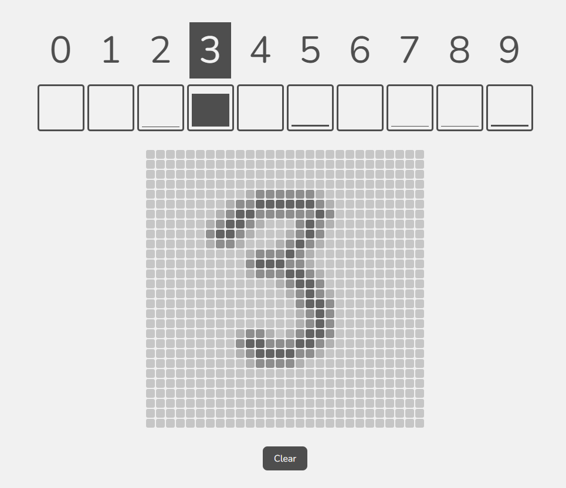

# Convolutional Neural Network (CNN) from Scratch in TypeScript

## Overview

This project implements a Convolutional Neural Network (CNN) from scratch in TypeScript, a statically typed superset of JavaScript. CNNs are a type of artificial neural network commonly used in image recognition and computer vision tasks. This implementation is designed to provide a simple yet effective example of a CNN for educational purposes.

To validate and demonstrate the functionality of the implemented CNN, it has undergone training using the widely recognized [MNIST Dataset](https://www.kaggle.com/datasets/hojjatk/mnist-dataset). The MNIST Dataset serves as a benchmark for image classification tasks, particularly for recognizing hand-written digits. 


## Features

- **Convolutional Layers:** The network includes convolutional layers to automatically learn hierarchical representations of the input data.

- **Pooling Layers:** Pooling layers are incorporated to reduce the spatial dimensions of the intermediate feature maps and control overfitting.

- **Fully Connected Layers:** Fully connected layers are used for classification based on the learned features.

- **Activation Functions:** ReLU (Rectified Linear Unit), Softmax and sigmoid activation functions are applied to introduce non-linearity into the network.

```bash
    # Example of CNN definition

    const rowSize = 28
    const inputLength = rowSize * rowSize
    const layers: NetworkLayerInfo[] = [
      {
        numFilters: 3,
        filterSize: 5,
        rowSize,
        activationFn: "relu",
        poolSize: 2
      },
      {
        numNeurons: 60,
        activationFn: "sigmoid"
      },
      {
        numNeurons: 10,
        activationFn: "softmax"
      }
    ]
    const network = new Network()
    network.init(inputLength, layers)
```
## Getting Started

### Prerequisites

Make sure you have Node.js and npm installed on your machine.

```bash
# Install Node.js and npm
https://nodejs.org/
```

### Installation
 1. Clone the repository: 
```bash
git clone https://github.com/lluis-mendoza/cnn-typescript.git
```
 2. Install dependencies: 
```bash
cd cnn-typescript
npm install
```

###Usage
```bash
# Run the example
npm run dev

#Train CNN
npm run train
```

Feel free to explore and modify the code to better suit your educational or experimental needs. If you encounter any issues or have suggestions for improvement, please contribute by opening an issue or creating a pull request.

### License

This project is licensed under the MIT License - see the [LICENSE](/LICENSE.txt) file for details.